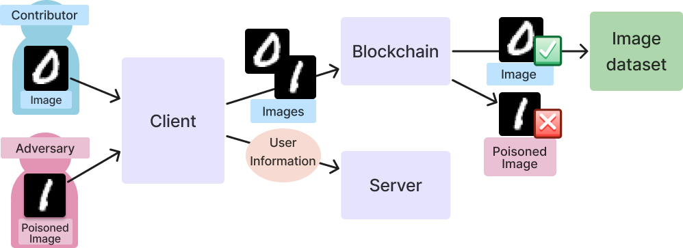

# SeBRUS: Mitigating Data Poisoning Attacks on Crowdsourced Datasets with Blockchain


With the rise in prominence of crowdsourced datasets in machine learning, data poisoning attacks pose a considerable threat. Many current defenses fall short because they are overly specialized for certain attacks, lack contribution incentives, and are difficult to integrate into current platforms. This paper explores the underaddressed system security problem posed by data poisoning through SeBRUS, a comprehensive data contribution application that leverages Ethereum smart contracts to secure crowdsourced datasets. SeBRUS introduces a voting network and poisoned data detection model, allowing for easy implementation with current platforms to defend against label-flipping, clean-label, and backdoor attacks.

This is [SeBRUS (SEH-BRUS)](https://en.wikipedia.org/wiki/Cerberus), or Secure Blockchain Regularization Upload System. This repository consists of the code for the SeBRUS application associated with our group's research. SeBRUS is built to allow for simple and secure machine learning dataset contribution by using the Ethereum blockchain to ensure the security of crowdsourced contributions to machine learning datasets.

This research project was conducted as part of the [Governor's School of Engineering and Technology](https://soe.rutgers.edu/academics/pre-college-engineering-programs/new-jersey-governors-school-engineering-and-technology) 2023 program. To read more about our research, please read our [paper](./.github/paper.pdf) which was accepted to the 2023 [MIT IEEE Undergraduate Research Technology Conference](https://urtc.mit.edu/). For a demonstration of how to use our project, please watch this [video](https://drive.google.com/file/d/1mqfoFTWgBrgPmEPCjlzGkFySi_8S5huI/view?usp=sharing).

## Dependencies
In order to use or develop SeBRUS, you will need the following dependencies:
- [Node.js](https://nodejs.org/en/): A JavaScript runtime environment.
- [Yarn](https://yarnpkg.com/): A package manager for Node.js used for our React frontend.
- [Python 3.0](https://www.python.org/): Used for our Flask backend server.
- [Metamask](https://metamask.io/): A browser extension that allows you to interact with the Ethereum blockchain.
- [Ganache](https://trufflesuite.com/ganache/): A local blockchain for Ethereum development.
- [Truffle](https://www.trufflesuite.com/truffle): A development environment for Ethereum.

## Starting SeBRUS
Make sure to always start from scratch if the system has been started before. Delete test networks and accounts from MetaMask, the folder `blockchain/build`, the folder `server/abi`, and `server/sqlite.db`. After installing the above dependencies, clone this repository and follow the instructions below.

```bash
git clone https://github.com/bliutech/SeBRUS.git
cd SeBRUS/
```

### 1. Start Ganache & MetaMask
Start running a` Quickstart` workspace in Ganache. Under `Contracts`, link a Truffle project (`truffle-config.js`) in the `Workspace` section, and then set the gas limit to a larger number (ex. 1000000000000000) under the `Chain` section. This is to account for the large gas costs that come with contract calls for larger images.

In MetaMask, create a new test network under the `Networks` tab. Set any name for the network, and complete the following fields:

 * New RPC URL: http://127.0.0.1:7545
 * Chain ID: 1337
 * Currency symbol: ETH

Next, import a new account in MetaMask. Under the `Accounts` section in Ganache, select an account. Do not select the first account (Index 0), this is reserved for deploying contracts with Truffle. Copy and paste the private key (not the account address) into MetaMask to import this wallet.

### 2. Start the Server
The next step is to start the Flask server. This will automatically create the SQLite database and populate it with the necessary tables. Inside the repository, run the following commands. The server should be deployed to http://localhost:5000/.

```bash
cd server
virtualenv venv --python=3.10
source venv/bin/activate
pip install -r requirements.txt
python app.py
```

### 3. Deploy the Smart Contracts
The next step is to deploy the smart contracts to the blockchain. This will create the necessary contracts and populate them with the necessary data. A supplemental script has been created to help register the corresponding ABI information to the SeBRUS backend. Inside the repository, run the following commands.

```bash
cd blockchain
truffle compile
truffle migrate
python register.py
```

### 4. Run the Client
The final step is to run the React client to interface with SeBRUS. This will automatically open a browser window to http://localhost:3000/. Inside the repository, run the following commands.

```bash
cd client
yarn install
yarn start
```

Due to gas limits, uploaded images must be limited to a smaller size. Images from the MNIST (28x28) and CIFAR (32x32) datasets are suitable.

## Linting
This project supports CI/CD for linting. For the server application, utilize `black` for linting. To check if any formatting changes need to be made, run the following.

```
python -m black --check *.py
```

To resolve any needed changes run
```
python -m black *.py
```

For the client application, utilize `prettier` for linting. To check if any formatting changes need to be made, run the following.

```
npm run check
```

To resolve any needed changes run
```
npm run fix
```

## Troubleshooting
When trying to run 
```virtualenv venv --python=3.10```, a ```zsh: command not found: virtualenv``` error may come up. If Anaconda is installed on your computer, you will have to run:
```bash
cd server
conda deactivate 
pip install virtualenv
virtualenv venv
source venv/bin/activate
```

## Authors
SeBRUS was developed by Anusha Iyer, Chloe Lee, Cyrus Rosenberg, Rebekah Wang, & Trisha Reddy for GSET 2023. The project was advised by Benson Liu as their project mentor. For any questions or requests for additional information, please contact the authors.
